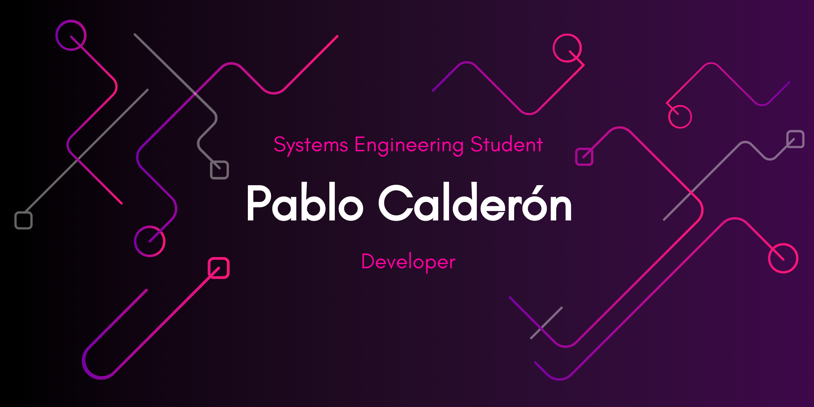

  <h1>🌟 Welcome to Colo's GitHub Profile! 🌟</h1>

  <h1 style="color: #4A90E2;">👨‍💻 Pablo Ariel Calderon - Colo 👨‍💻</h1>
  
🂠22 years old | 📠Systems Engineering Student

  
📚 Currently in my fourth year at <strong>Universidad Adventista del Plata</strong>

  <h2 style="color: #FF6F61;">🔍 About Me</h2>
  
Hi! I'm Colo, a passionate and dedicated programmer with a strong foundation in various technologies. I'm constantly exploring new domains and currently focusing on mastering JavaScript, TypeScript, and Node.js.

  <h2 style="color: #6B5B95;">🚀 My Expertise</h2>
  <ul>
    <li><strong>💻 Frontend:</strong> HTML5, CSS, Tailwind</li>
    <li><strong>🔧 Backend:</strong> Python, C#, C++</li>
    <li><strong>🗄️ Databases:</strong> MySQL, SQLite, MongoDB, Oracle</li>
    <li><strong>📘 Learning:</strong> JavaScript, TypeScript, Node.js</li>
  </ul>

  <h2 style="color: #88B04B;">📂 Projects</h2>
  
Stay tuned for upcoming projects! I'm currently working on exciting web applications and backend services.

  

-------------------------------------------------------------------------------------------------------------------------------------------------------

  
  
  
  
  
  
  
  
  
  
  
  
  

